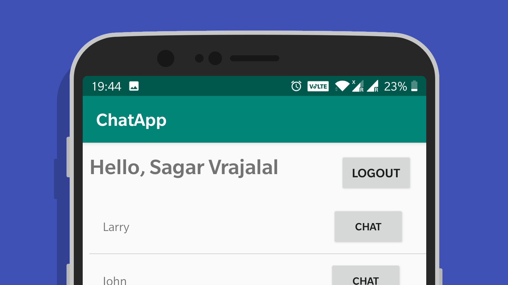

# Movies and TV Shows Tracker

This is a simple chat application that uses [Google Firebase](https://firebase.google.com) and your Google Account to let you talk to other users.

Features :
- Login/Logout
- View online Users
- Chat with people

## Installation Instructions

Start by going to [Google Firebase](https://firebase.google.com) and creating a free account. Go to the console and click on add new project. Name the project as `com.example.chatapp`

Then, head over to your project settings and under Sign-In-Method in Authentication, ensure that you enable Google sign-in.

Go back to General Settings, and add your SHA certificate fingerprints. Google how to do it if you're not sure.

Next, download the `google.services.json` file from the same page. The button is located above your app id.

Drop this file inside the src folder of your app.

Open up terminal, and run `./gradlew run` from the root of the project folder.

## Built With

- Java
- Google Firebase (Cloud Firestore)

## Contributing

Soon!

## Authors

- Sagar Vrajalal (Entirety)

## Fun Fact

This project was built in 4 days with no prior knowledge of building Android Apps! Excuse the mess and lack of documentation. Will make improvements.

## License

This project is licensed under the MIT License - see the [LICENSE.md](LICENSE.md) file for details.
